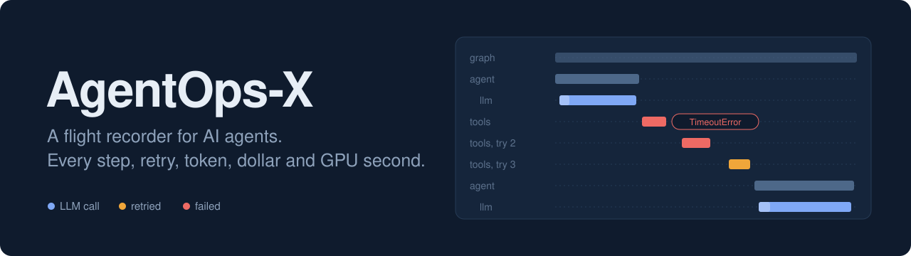
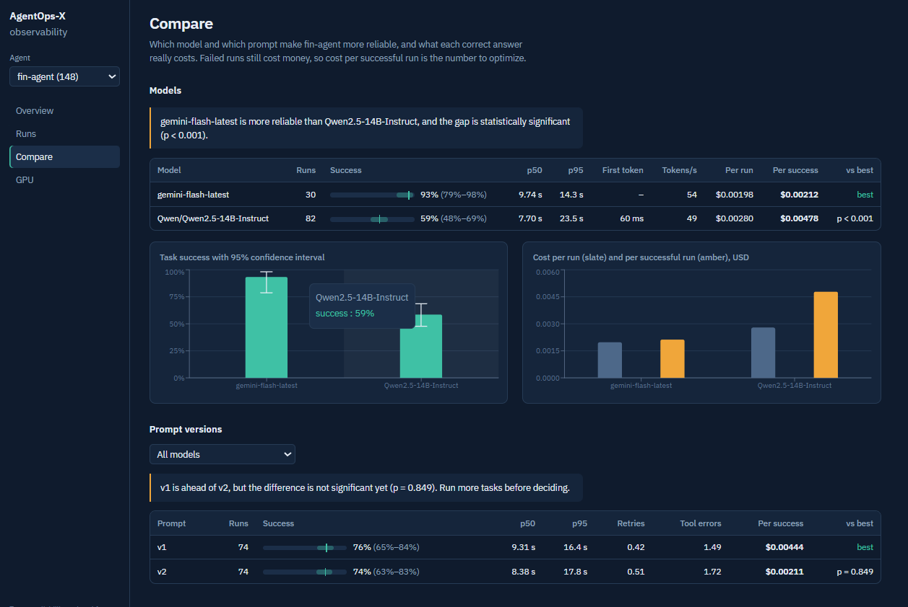
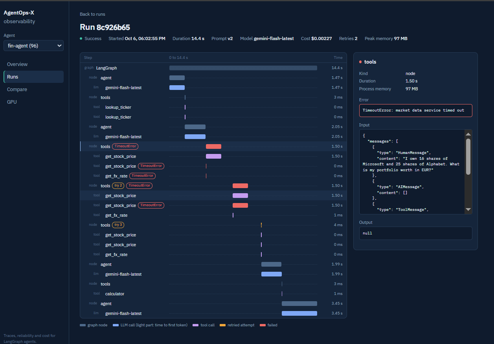
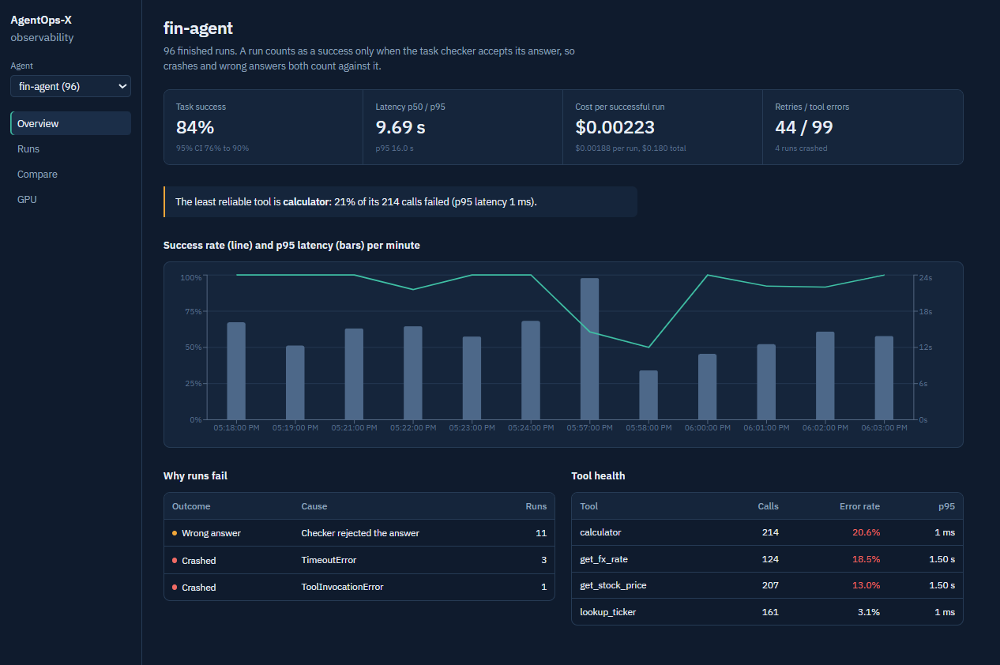
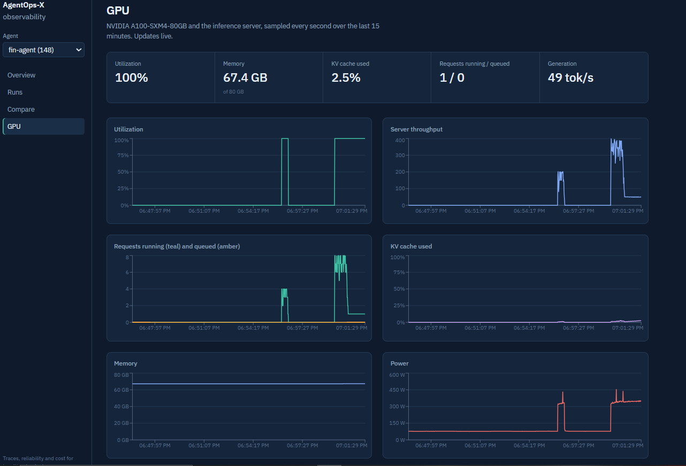
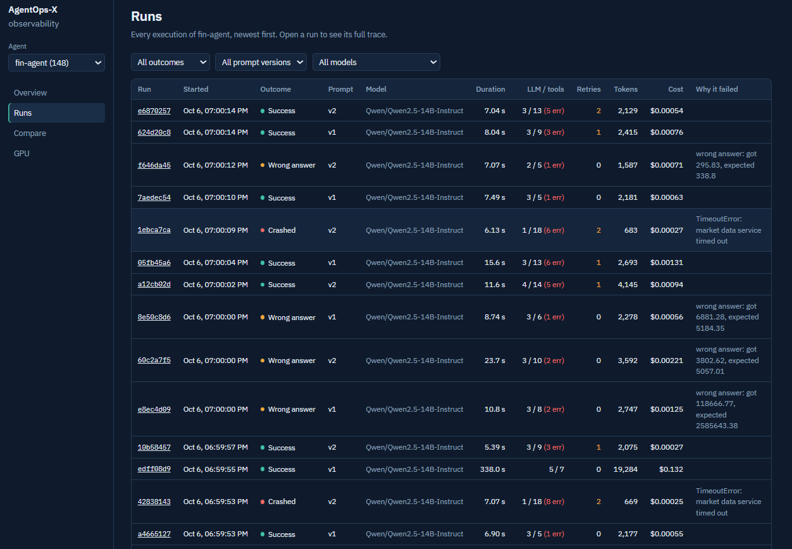
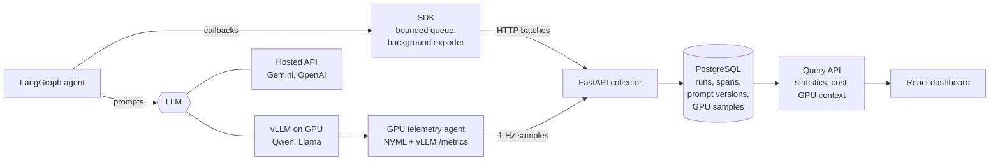

<p align="center">
  
</p>

<p align="center">
  
  
  
  
  
  
</p>

<p align="center">
  <a href="#what-it-found">What it found</a> ·
  <a href="#a-look-inside">Screenshots</a> ·
  <a href="#how-it-works">How it works</a> ·
  <a href="#quickstart">Quickstart</a> ·
  <a href="#design-decisions">Design decisions</a>
</p>

---

An agent can look perfect in a demo and still fail quietly in production. When it does, the hard part is not noticing the failure. It's answering **why**: was it a tool call, a prompt change, a retry storm, a slow model, the cost, or the state the agent was carrying?

**AgentOps-X** records every execution of a LangGraph agent, down to each graph node, LLM call, tool call and retry, and turns those traces into answers. It works with hosted APIs and with models you run on your own GPU, where it also records what the hardware was doing during every call.

```python
import agentops

with agentops.run("fin-agent", input=question, prompt_version=("v2", PROMPT)) as run:
    result = graph.invoke(state, config={"callbacks": [run.callback]})   # one line of instrumentation
    run.mark_success(is_correct(result))
```

## What it found

I ran the same LangGraph finance agent (ticker lookup, prices, FX, calculator, with injected timeouts and latency spikes) 30 times on a hosted model and 30 times on an open model served on an NVIDIA A100. Every answer was checked against a known correct value.

| | Gemini 3 Flash (hosted API) | Qwen2.5-14B-Instruct (self-hosted, A100) |
|---|---|---|
| Task success | **93%** (95% CI 79–98%) | 60% (95% CI 42–75%) |
| Median latency | 9.7 s | **6.9 s** |
| p95 latency | **14.3 s** | 21.7 s |
| Time to first token | n/a | **60 ms** |
| Cost per run | $0.00198 | **$0.00149** |
| **Cost per successful run** | **$0.00212** | $0.00248 |

Three things the traces made visible:

1. **The cheaper model is the expensive one.** Qwen costs 25% less per run, but it fails so much more often that every *correct* answer costs 17% more. Failed runs still burn tokens and GPU time, so AgentOps-X ranks models by cost per successful run, not cost per call.
2. **The gap is real, not noise.** 28/30 vs 18/30 gives p = 0.002 on a two-proportion test, and the dashboard says so in plain words. With fewer runs it says the opposite: "not significant yet, run more tasks."
3. **The weakest link was not the flaky service.** The tools with injected timeouts recovered through retries. The least reliable tool turned out to be the calculator, with 21% of 214 calls failing, because of what the agents sent it rather than because it was down.

<p align="center"></p>

## A look inside

<table>
<tr>
<td width="50%"><br><b>Trace waterfall.</b> Every node, LLM call and tool call on one timeline. Retried attempts are striped amber, failures are red, and the light part of each LLM bar is time to first token. Click any step for its inputs, outputs, error, tokens, cost and the GPU state while it ran.</td>
<td width="50%"><br><b>Overview.</b> Task success with its confidence interval, p50/p95 latency, cost per successful run, why runs fail, and which tool is the weakest.</td>
</tr>
<tr>
<td width="50%"><br><b>Live GPU.</b> Utilization, memory, KV cache, running and queued requests, throughput and power, sampled every second from NVML and vLLM.</td>
<td width="50%"><br><b>Runs.</b> Every execution, filterable by outcome, prompt version and model, with retries, tool errors, tokens, cost and the reason it failed.</td>
</tr>
</table>

<!-- Optional demo GIF: save it as docs/demo.gif and uncomment the next line.
<p align="center"></p>
-->

## What it captures

| Signal | How |
|---|---|
| Trace tree | graph → nodes → LLM calls and tool calls, as parent-child spans |
| Retries | re-executions of a node within the same graph step (LangGraph `RetryPolicy`) and LLM-client retries |
| Tool failures | exceptions, plus tools that return an error message instead of raising |
| Latency | per step and per run; p50/p95 per model and per prompt version |
| Cost | tokens × price for APIs; batching-aware GPU time for self-hosted models |
| Memory | process memory per step, peak per run, and the size of the agent's state |
| Task success | your own checker, kept separate from crashes |
| GPU | utilization, memory, power, KV cache, queue depth and throughput, aligned to each LLM call |

## How it works



## Design decisions

These are the choices that turn a logging script into something you could run in production.

- **The SDK can never take the agent down.** Events go into a bounded queue and a background thread ships them in batches. If the collector is unreachable, the agent keeps running at full speed and the SDK drops events with a counter instead of blocking or buffering forever. Every callback swallows its own exceptions.
- **Ingestion is idempotent.** Runs and spans carry client-generated UUIDs and are written as upserts, so a retried batch never creates duplicates. A span that arrives before its run gets a placeholder run instead of a foreign-key error.
- **Prompt versions are content-addressed.** A prompt version is identified by the SHA-256 of its template, so editing a prompt creates a new version automatically and comparisons can't silently mix two different prompts under one name.
- **Aggregates are computed on the server.** Tokens, cost, retries, tool errors and peak memory are rolled up from spans in the same transaction that closes the run, so the client can't report numbers that disagree with its own trace.
- **Success rates come with honest error bars.** Every rate has a 95% Wilson interval (correct even at small sample sizes), and comparisons use a two-proportion z-test, so "v2 is better" is a measured claim.
- **GPU cost is batching-aware.** A GPU serving four requests at once costs each of them a quarter as much. Each self-hosted LLM call is charged `latency × GPU price ÷ average concurrent requests` during that call, using the telemetry samples.
- **The model server is its own service.** vLLM runs in a separate environment with its own pinned PyTorch/CUDA stack and is reached over the OpenAI-compatible API, so the platform's dependencies never fight the inference stack.
- **Built with real models, not just mocks.** Running against Gemini 3 surfaced a real integration bug: its OpenAI-compatible endpoint drops the "thought signatures" Gemini 3 requires across tool-calling turns, so every multi-step run failed with HTTP 400. The traces showed every run dying at the same step with the same error, which pointed straight at it; the fix was to use the native Gemini client.

## Quickstart

Needs Linux. No root and no Docker required: everything installs in user space.

```bash
bash scripts/setup.sh              # Python, PostgreSQL and Node in user space, virtualenv `Aopx`, database
source Aopx/bin/activate
cp .env.example .env               # add an LLM API key
bash scripts/serve.sh              # PostgreSQL + API + dashboard on http://127.0.0.1:8000
python -m demo.run --runs 30       # traced runs of the demo agent (second terminal)
```

No API key? `DEMO_FAKE_LLM=1 python -m demo.run --runs 100` runs the agent on a scripted offline model.

<details>
<summary><b>Self-hosted model on a GPU</b></summary>

```bash
bash scripts/setup_gpu.sh                    # separate virtualenv for vLLM
bash scripts/llm.sh                          # serve Qwen2.5-14B-Instruct with tool calling
python -m agentops.gpu                       # GPU + inference-server telemetry
python -m demo.run --llm local --runs 30     # same agent, self-hosted model
python -m demo.run models                    # hosted vs self-hosted, head to head
```
</details>

<details>
<summary><b>API reference</b></summary>

| Endpoint | Returns |
|---|---|
| `POST /v1/ingest` | batched run and span events from the SDK |
| `POST /v1/gpu` | GPU telemetry samples |
| `GET /api/summary?agent=` | headline numbers: success with CI, latency, cost per success |
| `GET /api/runs` | runs, filterable by outcome, prompt version and model |
| `GET /api/runs/{id}` | full trace with per-call decode speed and GPU context |
| `GET /api/models?agent=` | model head-to-head with significance tests |
| `GET /api/prompt-versions?agent=` | prompt version comparison with significance tests |
| `GET /api/failures?agent=` | failure causes and tool health |
| `GET /api/timeseries?agent=` | success rate, p95 latency and cost over time |
| `GET /api/gpu/timeseries` | recent GPU telemetry |
</details>

## Repository layout

```
agentops/     SDK: run context, LangGraph callback, batching exporter, pricing, GPU telemetry agent
server/       FastAPI collector and query API, SQLAlchemy models, ingestion, statistics
dashboard/    React + TypeScript dashboard (Vite, Recharts)
demo/         LangGraph finance agent with fault injection, verifiable tasks, load generator
scripts/      setup, database, model server and dashboard build scripts
```

## Roadmap

- [x] SDK, collector, PostgreSQL data model, statistics API, demo agent with fault injection
- [x] Self-hosted LLMs on GPU with vLLM, GPU-aware tracing, batching-aware GPU cost
- [x] Dashboard: overview, run explorer, trace waterfall, model and prompt comparison, live GPU view
- [ ] AI root-cause analyst that clusters failures and explains each cluster
- [ ] Chaos testing: inject faults on purpose and score how reliably an agent recovers
- [ ] Replay a failed run from any step with a changed prompt
- [ ] Docker Compose, database migrations, test suite
